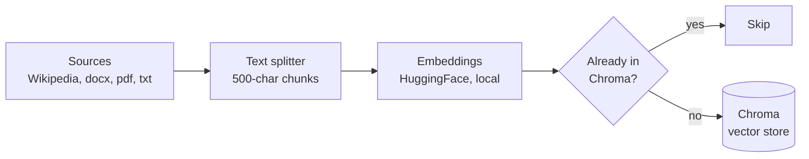
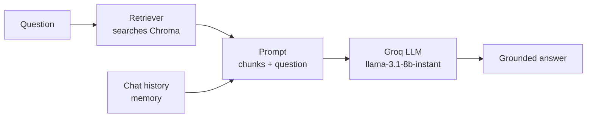

# RAG Q&A Chatbot (LangChain + Chroma + Groq)

A Retrieval-Augmented Generation (RAG) chatbot that answers questions grounded in a
set of ingested documents (Wikipedia articles, `.docx`, `.pdf`, `.txt` files), using:

- **[LangChain](https://python.langchain.com/)** for orchestration
- **[Chroma](https://www.trychroma.com/)** as the vector store (persisted locally)
- **[HuggingFace `sentence-transformers`](https://www.sbert.net/)** for local, free embeddings
- **[Groq](https://groq.com/)** for fast, free-tier LLM inference (`llama-3.1-8b-instant`)

## How it works

### 1. Ingestion (run once, or whenever documents change)

Documents from Wikipedia and local folders are loaded, split into chunks, embedded
locally, and stored in a persistent Chroma vector database. Each chunk is given a
deterministic ID (a hash of its source + content), so re-running ingestion never
creates duplicates — only genuinely new/changed content gets added.



### 2. Query & answer (runs on every question)

A question is embedded, used to retrieve the most relevant chunks from Chroma, and
combined with those chunks (plus recent chat history) into a prompt sent to Groq's
LLM — which answers using only that retrieved context, and says "I don't know" if
the context doesn't cover it.



This separation is the core idea behind RAG: ingestion happens ahead of time and
builds the knowledge base; retrieval happens live per-question, so only the relevant
chunks (not the whole document collection) are sent to the LLM.

## Project layout

```
langchain-rag-chatbot/
├── documents/
│   ├── Paestum/                  # Paestum-specific docx/pdf/txt source files
│   └── CilentoTouristInfo/        # Cilento-region docx/pdf/txt source files
├── src/
│   ├── config.py                  # env-based configuration
│   ├── loaders.py                  # per-extension loader dispatch + folder iteration
│   ├── vector_store.py              # Chroma setup, splitting, hash-based dedup, ingestion
│   ├── prompts.py                     # simple vs. persona+memory chat prompts
│   └── chatbot.py                       # RagChatbot class (LCEL RAG chain, conversational memory)
├── ingest.py                     # populates Chroma from Wikipedia + local folders
├── main.py                       # CLI: single question or interactive chat loop
├── requirements.txt
├── .env.example
└── chroma_db/                     # created at runtime, persisted Chroma DB (gitignored)
```

## Setup

```bash
python -m venv .venv
source .venv/bin/activate        # Windows: .venv\Scripts\activate
pip install -r requirements.txt

cp .env.example .env             # Windows: copy .env.example .env
# edit .env and set GROQ_API_KEY (free key: https://console.groq.com/keys)
```

Drop your own source files into `documents/Paestum/` and
`documents/CilentoTouristInfo/` (`.docx`, `.pdf`, or `.txt`).

## Usage

```bash
# ingest Wikipedia + both local folders into Chroma (safe to re-run - dedup applies)
python ingest.py

# ask one question (no memory, single retrieval + answer)
python main.py "How many temples are in Paestum, who constructed them, and what architectural style are they?"

# interactive chat with conversational memory
python main.py
# then: "reset" clears memory, "exit"/"quit" stops
```

### Example (real output)

```
You: How many temples are in Paestum and what style are they?
Bot: There are three ancient Greek temples in Paestum, built in the Doric order,
dating from around 550 to 450 BCE. They are well-preserved and considered some of
the finest examples of Doric architecture in the world.

You: And who built them?
Bot: The three ancient Greek temples in Paestum were built by settlers from
Sybaris, a Greek colony in southern Italy, under the name of Poseidonia, around
600 BCE...
```

The second answer correctly resolves "them" using conversational memory from the
prior turn — this is the LCEL chain's `chat_history_messages` input at work.

## Configuration (`.env`)

| Variable | Default | Purpose |
|---|---|---|
| `GROQ_API_KEY` | — | Your Groq API key (required) |
| `GROQ_MODEL` | `llama-3.1-8b-instant` | Chat model used for answers |
| `EMBEDDING_MODEL` | `sentence-transformers/all-MiniLM-L6-v2` | Local embedding model (downloaded once on first run) |
| `CHROMA_COLLECTION_NAME` | `tourist_info` | Chroma collection name |
| `CHROMA_PERSIST_DIR` | `./chroma_db` | Where Chroma persists data |
| `WIKIPEDIA_QUERY` | `Paestum` | Wikipedia article(s) to ingest |
| `CILENTO_DIR` / `PAESTUM_DIR` | `./documents/...` | Local folders to ingest |
| `CHUNK_SIZE` / `CHUNK_OVERLAP` | `500` / `0` | Text splitting parameters |

## Notes / things to know

- **Persistence**: Chroma uses `persist_directory`, so ingested data survives across
  runs — only re-run `ingest.py` when you add/change documents.
- **Idempotent ingestion**: each chunk's ID is a SHA-256 hash of its source, page
  number (if any), and exact text. Running `ingest.py` multiple times is safe —
  already-ingested chunks are skipped, only new/changed content is added.
- **Wikipedia ingestion is best-effort**: the `wikipedia` package occasionally hits
  transient API errors; `ingest.py` catches these and continues with local folders
  rather than failing the whole run.
- **Chat memory** (`RagChatbot`) is in-memory only, per process — it resets each time
  you restart `main.py`, or when you type `reset` in the interactive loop.

## Possible extensions

- Persisted chat history (file/DB) instead of in-memory only
- A FastAPI wrapper exposing `/ask` and `/ingest` endpoints
- `unstructured`'s `DirectoryLoader` for recursive, format-agnostic folder ingestion
  (an alternative to the current per-extension dispatch in `src/loaders.py`)
- LangSmith tracing, if you want request-level observability later — LangChain
  picks up `LANGSMITH_*` environment variables automatically, no code changes needed