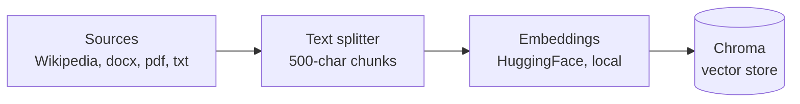
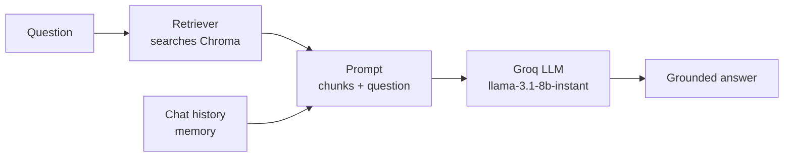

# RAG Q&A Chatbot (LangChain + Chroma + Groq)

A Retrieval-Augmented Generation (RAG) chatbot that answers questions grounded in a
set of ingested documents (Wikipedia articles, `.docx`, `.pdf`, `.txt` files), using:

- **[LangChain](https://python.langchain.com/)** for orchestration
- **[Chroma](https://www.trychroma.com/)** as the vector store (persisted locally)
- **[HuggingFace `sentence-transformers`](https://www.sbert.net/)** for local, free embeddings
- **[Groq](https://groq.com/)** for fast, free-tier LLM inference (`llama-3.1-8b-instant`)

## How it works

### 1. Ingestion (run once, or whenever documents change)

Documents from Wikipedia and local folders are loaded, split into chunks, embedded
locally, and stored in a persistent Chroma vector database.



### 2. Query & answer (runs on every question)

A question is embedded, used to retrieve the most relevant chunks from Chroma, and
combined with those chunks into a prompt sent to Groq's LLM — which answers using
only that retrieved context (and says "I don't know" if the context doesn't cover it).



This separation is the core idea behind RAG: ingestion happens ahead of time and
builds the knowledge base; retrieval happens live per-question, so only the relevant
chunks (not the whole document collection) are sent to the LLM.

## Project layout

```
langchain-rag-chatbot/
├── documents/
│   ├── Paestum/                  # Paestum-specific docx/pdf/txt source files
│   └── CilentoTouristInfo/        # Cilento-region docx/pdf/txt source files
├── src/
│   ├── config.py                  # env-based configuration
│   ├── loaders.py                  # per-extension loader dispatch + folder iteration
│   ├── vector_store.py              # Chroma setup, splitting, ingestion
│   ├── prompts.py                     # simple vs. persona+memory chat prompts
│   └── chatbot.py                       # RagChatbot class (conversational chain)
├── ingest.py                     # populates Chroma from Wikipedia + local folders
├── main.py                       # CLI: single question or interactive chat loop
├── requirements.txt
├── .env.example
└── chroma_db/                     # created at runtime, persisted Chroma DB (gitignored)
```

## Setup

```bash
python -m venv .venv
source .venv/bin/activate        # Windows: .venv\Scripts\activate
pip install -r requirements.txt

cp .env.example .env             # Windows: copy .env.example .env
# edit .env and set GROQ_API_KEY (free key: https://console.groq.com/keys)
```

Drop your own source files into `documents/Paestum/` and
`documents/CilentoTouristInfo/` (`.docx`, `.pdf`, or `.txt`).

## Usage

```bash
# ingest Wikipedia + both local folders into Chroma
python ingest.py

# ask one question (no memory, single retrieval + answer)
python main.py "How many temples are in Paestum, who constructed them, and what architectural style are they?"

# interactive chat with conversational memory
python main.py
# then: "reset" clears memory, "exit"/"quit" stops
```

## Configuration (`.env`)

| Variable | Default | Purpose |
|---|---|---|
| `GROQ_API_KEY` | — | Your Groq API key (required) |
| `GROQ_MODEL` | `llama-3.1-8b-instant` | Chat model used for answers |
| `EMBEDDING_MODEL` | `sentence-transformers/all-MiniLM-L6-v2` | Local embedding model (downloaded once on first run) |
| `CHROMA_COLLECTION_NAME` | `tourist_info` | Chroma collection name |
| `CHROMA_PERSIST_DIR` | `./chroma_db` | Where Chroma persists data |
| `WIKIPEDIA_QUERY` | `Paestum` | Wikipedia article(s) to ingest |
| `DOCUMENTS_DIR` / `CILENTO_DIR` / `PAESTUM_DIR` | `./documents/...` | Local folders to ingest |
| `CHUNK_SIZE` / `CHUNK_OVERLAP` | `500` / `0` | Text splitting parameters |

## Notes / things to know

- **Persistence**: Chroma uses `persist_directory`, so ingested data survives across
  runs — only re-run `ingest.py` when you add/change documents.
- **No dedup on re-ingest**: running `ingest.py` twice duplicates everything already
  in the collection (no ID-based check). Delete `chroma_db/` first if you want a
  clean re-ingest, or ask for ID-based dedup to be added.
- **Wikipedia ingestion is best-effort**: the `wikipedia` package occasionally hits
  transient API errors; `ingest.py` catches these and continues with local folders
  rather than failing the whole run.
- **Chat memory** (`RagChatbot`) is in-memory only, per process — it resets each time
  you restart `main.py`.
- **LangSmith tracing** (optional): set the `LANGSMITH_*` environment variables
  (see `.env.example`) to trace ingestion/retrieval/LLM calls at
  [smith.langchain.com](https://smith.langchain.com) — no code changes needed.

## Possible extensions

- ID-based dedup on ingestion so re-running `ingest.py` is idempotent
- Persisted chat history (file/DB) instead of in-memory only
- A FastAPI wrapper exposing `/ask` and `/ingest` endpoints
- Swapping in `unstructured`'s `DirectoryLoader` for recursive folder ingestion